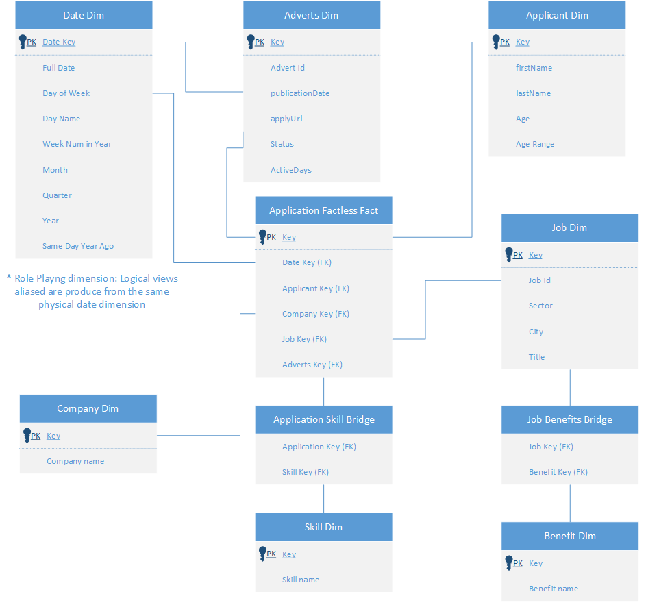

# job-postings-dwh

Kimball dimmensional model and ETL design and implementation on job postings dataset


## Data

The dataset consists of a sample of 30,000 jobs from 2010 to 2020 that were posted through the Armenian human resource portal CareerCenter.

A job posting usually has some structure, although some fields of the posting are not necessarily filled out by the creator (poster). The job data includes information about the applicants.

The dataset is in JSON format according to the next schema and it partitioned every 300 objects.

The data schema as well as a row sample can be revised below.

Data Schema


Json data row sample:

```javascript
[
  {
    "id": "e4b558ad-adee-4ebc-8b6e-853a278e919a",
    "adverts": {
      "id": "99f54f6c-f8cd-4e1f-9d39-0a9e72192497",
      "activeDays": 12,
      "applyUrl": "https://istockphoto.com/lobortis/convallis.jsp?et=ut&ultrices=at&posuere=dolor&cubilia=quis&curae=odio&duis=consequat&faucibus=varius&accumsan=integer&odio=ac&curabitur=leo&convallis=pellentesque&duis=ultrices&consequat=mattis&dui=odio&nec=donec&nisi=vitae&volutpat=nisi&eleifend=nam&donec=ultrices&ut=libero&dolor=non&morbi=mattis&vel=pulvinar&lectus=nulla&in=pede&quam=ullamcorper&fringilla=augue&rhoncus=a&mauris=suscipit&enim=nulla&leo=elit&rhoncus=ac&sed=nulla&vestibulum=sed&sit=vel&amet=enim&cursus=sit&id=amet&turpis=nunc&integer=viverra&aliquet=dapibus&massa=nulla&id=suscipit&lobortis=ligula&convallis=in&tortor=lacus&risus=curabitur&dapibus=at&augue=ipsum&vel=ac&accumsan=tellus&tellus=semper&nisi=interdum&eu=mauris&orci=ullamcorper&mauris=purus&lacinia=sit&sapien=amet&quis=nulla&libero=quisque&nullam=arcu&sit=libero&amet=rutrum&turpis=ac&elementum=lobortis&ligula=vel&vehicula=dapibus&consequat=at&morbi=diam",
      "publicationDateTime": "1353621541",
      "status": "Inactive"
    },
    "benefits": [
      "Car",
      "Medical Insurance",
      "Phone",
      "Home Office"
    ],
    "company": "O'Conner Group",
    "sector": "Product Management",
    "title": "Statistician II",
    "city": "Hawassa",
    "applicants": [
      {
        "firstName": null,
        "lastName": null,
        "skills": null,
        "age": null,
        "applicationDate": null
      },
      {
        "firstName": null,
        "lastName": null,
        "skills": null,
        "age": null,
        "applicationDate": null
      },
      {
        "firstName": "Scarlett",
        "lastName": "Cowl",
        "skills": [
          "Eggs",
          "RTO",
          "EBR",
          "KVM",
          "EOC"
        ],
        "age": 35,
        "applicationDate": "1354226341"
      },
      {
        "firstName": "Noe",
        "lastName": "Groundwator",
        "skills": [
          "LDPE",
          "DFT",
          "Watercolor",
          "Online Travel",
          "TMJ Dysfunction"
        ],
        "age": 39,
        "applicationDate": "1354658341"
      },
      {
        "firstName": "Fonsie",
        "lastName": "Tomkin",
        "skills": [
          "Oracle",
          "Visual Basic",
          "MVS",
          "RPO",
          "SBIR"
        ],
        "age": 41,
        "applicationDate": "1353880741"
      }
    ]
  }
  ```


## Data Profiling


## Dimensional model

The dimensional design process revolves around low-level activities in a business process of organizations, declaring it's grain, and then it extends the model by determining dimensions and facts.

### 1. Business Process

The business of job advertising isn't just drived by the companies posting jobs, the real goal is met when job applicants submit their proposals and show interest on job positions, satisfying the organizations' needs. In this sense, the business process "transaction" to model is job applications submitted by job seekers.


### 2. Declare the Grain

The best granular data is generated by a job application submitted by a person to a individual job post. When a job applicant applies to a certain position, it also submits a collection of skill related to the job position, it could be tempting to set one row per skills submitted in the fact table, but this would exponentially increase the table size and impact performance. Thus, granularity will be set by individual job application and skills will be handled with dimension and bridge tables to keep fact table granularity at a reasonable size and detail.

### 3. Identify the Dimensions

When a job post is published, a "id" natural key is generated as well as the job title, it also describes a set of benefits of the position, company to work in, city, it's sector. A set of attributes pertaining the publication are also recorded, like activeDays of the publication, application URL, publication date and current status.

When a person applies for the job, their age, first name, last name and proposed skills are recorded. 

In this sense, the appropitate dimensions to model are: Date, Advertisement, Applicant, Job, Company, Skills, Benefits.

One of the most arguable decisions could be the fact that the applicant skills have been modeled as a dimension itself, instead of trying to couple skills inside the Applicant dimension. If you give some thought to it, whenever a applicant applies to a position, depending on the company and skills required, the applicant adapts it's resume, CV, and skills to the knowledge needed by the position. If one tries to capture skills as slowly changing attribute inside the Applicant dimension, the dimension modeling could end up being a big column and rows entanglement and will end up being hard to maintain. Instead, everytime an applicant submits applications to a job, their proposed skillset will be recorded at the fact table granular level, this allows full history recording and will simplify queries and model maintenance over time.

### 4. Identify the Facts

The business process in this dataset is connecting applicants to companies looking to fill a position, when job seekers apply and are accepted by a company, no quantifiable measures are generated. Thus, the fact table will record this events without recording any numeric transactiond data, also known as Factless Fact Table, at the event of application to the job only dimension characteristics are recordes.

The resulting dimensional model for the dataset after analysis is depicted below.




## Data dictionary for dimension and fact tables


## Dataflow explanation and diagram


